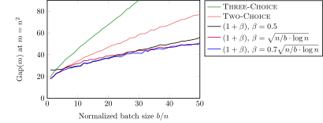

# Code for the  paper "Balanced Allocations in Batches: The Tower of Two Choices"

This repository contains the relatively simple C++ code for reproducing the experiments for the ${b\text{-}{\rm B{\small ATCHED}}}$ setting studied in the paper "Balanced Allocations in Batches: The Tower of Two Choices" which will appear in the SPAA 2023 conference ([arxiv version](https://arxiv.org/abs/2302.04399)).

The code produces the data points for the following four figures (see ``figs/raw.out`` for raw outputs):

* Average gap for the $(1+\beta)$-process in the ${b\text{-}{\rm B{\small ATCHED}}}$ setting with unit weights for $n = 1.000$ bins, $m = n^2$ balls, for various batch sizes and parameter values $\beta \in (0, 1]$ (averaged over $25$ runs).

<p align="center">

</p>

* Average gap for the ${\rm Q{\small UANTILE}}$ process (mixed with ${\rm O{\small NE}}\text{-}{\rm C{\small HOICE}}$ with probability $\eta \in (0, 1]$) in the ${b\text{-}{\rm B{\small ATCHED}}}$ setting with unit weights for $n = 1.000$ bins, $m = n^2$ balls, for various batch sizes and parameter values $\eta \in [0, 1]$ (averaged over $25$ runs).

<p align="center">

</p>

* Average gap for ${\rm T{\small HREE}}\text{-}{\rm C{\small HOICE}}$, ${\rm T{\small WO}}\text{-}{\rm C{\small HOICE}}$ and $(1+\beta)$ with $\beta = 0.5$, $\beta = \sqrt{(n/b) \cdot \log n}$ and $\beta = 0.7 \cdot \sqrt{(n/b) \cdot \log n}$ in the ${b\text{-}{\rm B{\small ATCHED}}}$ setting with unit weights for $n = 1.000$ bins, $m = n^2$ balls vs batch size $b \in \{ n, \ldots, 50n \}$ (averaged over $50$ runs).

<p align="center">

</p>

* Average gap for ${\rm T{\small HREE}}\text{-}{\rm C{\small HOICE}}$, ${\rm T{\small WO}}\text{-}{\rm C{\small HOICE}}$ and $(1+\beta)$ with $\beta = 0.5$, $\beta = \sqrt{(n/b) \cdot \log n}$ and $\beta = 0.7 \cdot \sqrt{(n/b) \cdot \log n}$ in the ${b\text{-}{\rm B{\small ATCHED}}}$ setting with weights from an $\mathsf{Exp}(1)$ distribution for $n = 1.000$ bins, $m = n^2$ balls vs batch size $b \in \{ n, \ldots, 50n \}$ (averaged over $50$ runs).

<p align="center">

</p>

* Average gap for ${\rm T{\small WO}}\text{-}{\rm C{\small HOICE}}$, ${\rm Q{\small UANTILE}}$ (with $\eta = \sqrt{(n/b) \cdot \log n}$) and $(1+\beta)$ (with $\beta = 0.7 \sqrt{(n/b) \cdot \log n}$) in the ${b\text{-}{\rm B{\small ATCHED}}}$ setting with $b \in \{ 20n, 50n, 80n \}$ and $n \in \{ 10^4, 10^5 \}$ (averaged over $20$ runs). The last column gives the average gap for ${\rm O{\small NE}}\text{-}{\rm C{\small HOICE}}$ with $m = b$ balls which is the theoretically optimal attainable value.

<p align="center">

</p>


## Build instructions

The entire code is a single C++ file (using the C++17 standard), so it can be run using 
```
g++ src/batched_spaa_23.cc && ./a.out
```
(or any other compiler). 

In the `/src` directory there is also a `CMakeLists.txt` file if you want to use `cmake`.

## Contact us

If you are having any trouble running the code or have any other inquiry, don't hesitate to contact us! You can either open an issue or send us an email (see [paper](https://arxiv.org/abs/2302.04399) for email addresses).
